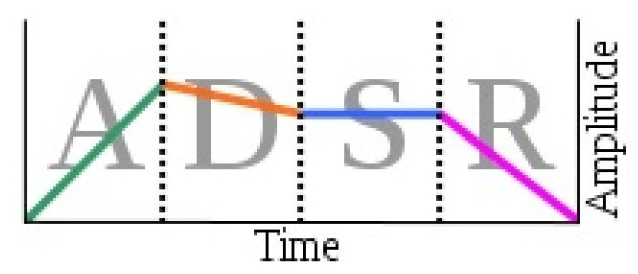

# Project Title

Music Synthesis in Matlab

## Overview

The objective of this project is to experiment synthesizing music using sinusoids. It is achieved by adding sine waves together, processing them at a desired frequency, and playing it back through a loudspeaker . This sound synthesis technique is also known as additive synthesis. Enhancements such as ADSR envelopes and Harmonics are introduced to the song to further improve the pleasantness of the sound.

## Usage

The project folder contains three subfolders. The wav subfolder inside the project contains various soundtracks synthesized with and without envelope and harmonics. These files can be played and compared to see the difference of sound enhancement. The code subfolder contains all of the sound data file and code. To get started.
1. Make sure the project folder is unzipped.
2. Navigate into "code" folder.
3. In the command window, type "setmlab". This command installs the toolbox for music synthesis.
4. If it didn't work, add the path of the musiclab folder to setmlab.m.
5. The test_script_beta.m is the driver for testing music synthesis. Inside the test script, it calls the synthandplay function for generating the sound wave. Then it plays the sound through a loudspeaker by calling soundsc function. Some default values are given to the test script, but users have the option to edit to their likings.

## Design Methodology

Function synthandplay performs the roles of reading in song file with .mat extension, generating sinusoids from the data, and synthesizing music. The signature of the function is shown below:

```javascript
function synthandplay (songfile_in, fs_in, justorwell_in, adsr_in, harmonics_in)
```

1. songfile_in is an user defined filename containing music data. Default value is “BWV847” for BWV847.mat file.
2. fs_in is an user defined frequency for which the song will be sampled at. Default sampling frequency is at 11025 Hz.
3. justorwell_in determines whether the song will be synthesized using just-tempered or well-tempered tuning. Well-tempered tuning is as default.
4. adsr_in is an user defined vector containing the duration for each sound stage. Note that all four stages in the vector should add up to 1.
5. harmonics_in is a vector containing the values for harmonic tuning.

Once the song file has been evaluated, a new variable is created as theVoices. Which is a structure containing information about melodies in the song. Each melody can be accessed as theVoices(n). In order to extract information for each melody, a for loop is used to iterate through each melody in theVoices to extract information such as the number of notes, the last pulse occurrence relative to the beginning, and the duration of a particular note. These fields will be used to synthesize music. Next, A nested for loop is used to synthesized the sound track one melody at time.

The outer for loop iterates through each melody again similar to the previous for loop shown before. Inside it is another for loop that iterates through each node. The purpose of the nested for loop is to be able to generate a segment of sound for every note of a melody, then all of the segments are pieced together to form the synthesized soundtrack for that particular melody. Since the nested for loop goes through all of the voices, the same process is repeated for each melody. With each melody synthesized, the song can then be played through a loudspeaker.

To synthesize for each note, the duration of note has to be computed. This is done by accessing the durations field of theVoices structure. It returns the duration for the note in pulses. However, function key2notewt and key2notejt only accept duration in seconds. A conversion is needed to be performed on duration by multiplying the duration in pulses with seconds per pulse. Once the duration is obtained, the program determines which tuning to be used for music synthesized. Both key2notewt and key2notejt have similar function signature. So key2notewt will be used to as an example.

```javascript
function xx = key2notewt (X, keynum, dur, adsr, harmonics)
```

1. X determines the amplitude or loudness of the sound.
2. Keynum is the note number. For example note number for C4 is 40.
3. adsr is a vector containing the duration for each sound stage. Note that all four stages in the vector should add up to 1.
4. harmonics is a vector containing the values for harmonic tuning.
5. xx is a vector containing the synthesized sound.

The function first synthesizes the music with the given duration and note number. Then it applies envelopes and harmonics to enhance the sound. The result of Synthesizing sound using well-tempered or just-tempered tuning is a flat and artificial soundtrack. This is because a musical instrument produces sound, the loudness of the sound changes over time in four stage manager.



The first stage is the attack. In this stage, the sound increases sharply from zero to full volume. The second stage is the decay. It describes how quickly the loudness of the sound decreases to the sustain level after the initial peak. The third stage is the sustain. In this stage the sound is played at a constant volume. Last is the release stage where the sound fades from a constant volume to zero. 

First the duration for each stage is calculated by multiplying the total duration with each element in the ADSR vector. Then each stage’s duration is converted to duration in samples by multiplying with the sampling frequency. Lastly, the envelope vector is formed by using the linspace function. The function takes in three values and generate linearly spaced values as that go from the first argument to the second argument in steps of the third argument. Once, the envelope is obtained, it is then applied to the synthesized sound by doing matrix multiplication.

Another technique used to enhance the sound is by applying harmonics. A harmonic is a signal whose frequency is multiple of the frequency of some wave. For example, if a signal whose

fundamental frequency is 100 Hz , then the second harmonic would appear at 200 Hz , the third harmonic would have a frequency of 300 Hz. By adding harmonics to the soundtrack, the spectrum of the sound becomes less clustered because notes become harmonically related.

First the amplitudes for the harmonics are computed by performing matrix division 1 over each harmonic. This is to make sure that the amplitude of higher harmonics will not become to large and distort the soundtrack. Then a for loop iterates through each of the harmonic and applies it to the synthesized soundtrack by doing matrix addition.
After applying ADSR envelope and harmonics, the resulting soundtrack might sound distorted. This because the amplitude of soundtrack might be too high. One way to solve this issue is by normalizing the amplitude to a range between 0 to 1. Normalizing the soundtrack ensures all of the amplitudes are scale down evenly to a value between 0 and 1. Then the final result then can be recorded using audiowrite function and played back through a loudspeaker.

## Author

* **Kaiwen Zheng** - *Initial work* - [kaiwen2times](https://github.com/kaiwen2times)

## License

This project is licensed under the MIT License - see the [LICENSE.md](LICENSE.md) file for details

## Acknowledgments

* Hat tip to anyone who's code was used
* RIT CMPE-480 is a great class!
* GOT TIGERS!!!
